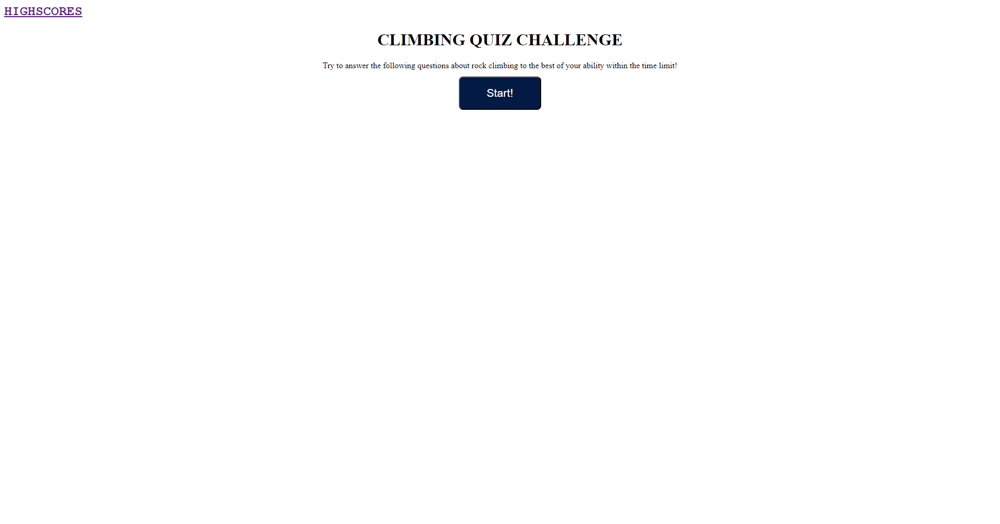
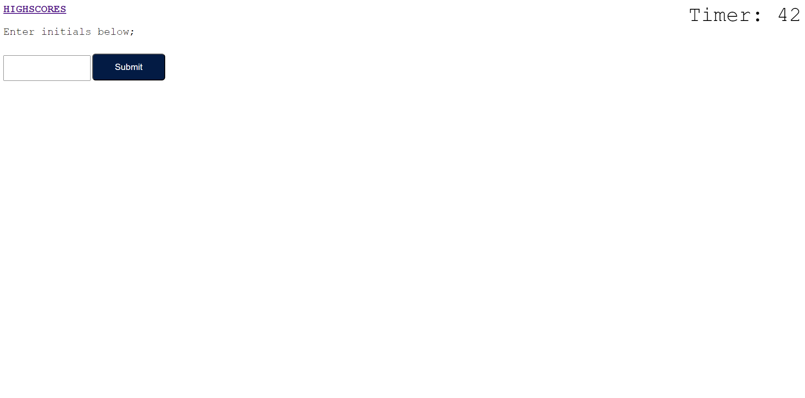

# How Well Do You Know Rock Climbing?

## Description

What I have created is a rock climbing quiz that will test your knowledge of the sport. The reason I built this product is to to incorporate the concepts of buttons, loops, event listeners, objects and local storage. Mastery of these concepts will help with future projects of larger magnitude as well as incorporating of more complex concepts such as jquery. Aside from all the concepts listed above, I learned the use case of attaching an HTML within an HTML and having 2 scripts.cs to help keep things organized.

## Table of Contents (Optional)

- [Usage](#usage)
- [Credits](#credits)
- [License](#license)

## Usage

Navigate to the urls located below and click start quiz to test your rock climbing knowledge. Upon right answer you will be directed to the next question. Upon incorrect answer you will have some time taken away from your time remaining. Once the timer hits 0, or you finish all the questions, you will be redirected to the score screen where you can input your initials. You can check your local hiscores by navigating to the HIGHSCORES page in the top left. 

[Github Page](https://dannymak1993.github.io/How-Well-Do-You-Know-Rock-Climbing-/)

[Repository](https://github.com/Dannymak1993/How-Well-Do-You-Know-Rock-Climbing-)

## Credits

I googled many concepts referring to eventlisteners, for loops, buttons, localstorage and objects. I also referred to many class activites for ideas on how to use these ideas statements.

## License

The MIT License (MIT)

Copyright (c) 2015 Chris Kibble

Permission is hereby granted, free of charge, to any person obtaining a copy of this software and associated documentation files (the "Software"), to deal in the Software without restriction, including without limitation the rights to use, copy, modify, merge, publish, distribute, sublicense, and/or sell copies of the Software, and to permit persons to whom the Software is furnished to do so, subject to the following conditions:

The above copyright notice and this permission notice shall be included in all copies or substantial portions of the Software.

THE SOFTWARE IS PROVIDED "AS IS", WITHOUT WARRANTY OF ANY KIND, EXPRESS OR IMPLIED, INCLUDING BUT NOT LIMITED TO THE WARRANTIES OF MERCHANTABILITY, FITNESS FOR A PARTICULAR PURPOSE AND NONINFRINGEMENT. IN NO EVENT SHALL THE AUTHORS OR COPYRIGHT HOLDERS BE LIABLE FOR ANY CLAIM, DAMAGES OR OTHER LIABILITY, WHETHER IN AN ACTION OF CONTRACT, TORT OR OTHERWISE, ARISING FROM, OUT OF OR IN CONNECTION WITH THE SOFTWARE OR THE USE OR OTHER DEALINGS IN THE SOFTWARE.
